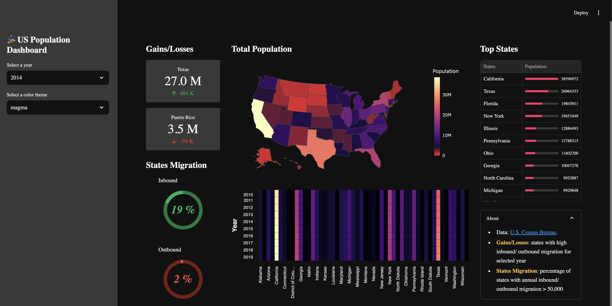
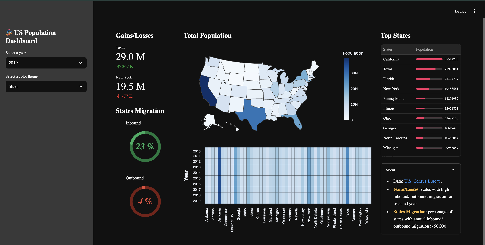

# 🏂 US Population Dashboard

A beautiful and interactive dashboard built with Streamlit that visualizes US population trends and migration patterns from 2010-2019. Created by Bilal.

[](https://population-dashboard.streamlit.app/)


## 🌟 Features

- Interactive US population choropleth map
- State-by-state population heatmap over time
- Population gains and losses tracking
- State migration patterns visualization
- Customizable color themes
- Mobile-responsive design

## 📸 Screenshots

### Default View

*Default Streamlit styling with clean, professional look*

### With Custom CSS Styling

*Enhanced UI with custom CSS for a more polished appearance*

## 🎯 Dashboard Components

1. **Population Map (Choropleth)**
   - Interactive US map showing population distribution
   - Color-coded states based on population density
   - Hover tooltips with detailed state information

2. **Gains/Losses Section**
   - Top gaining and losing states
   - Year-over-year population changes
   - Population metrics in easy-to-read format

3. **Migration Patterns**
   - Inbound and outbound migration tracking
   - Percentage visualization using donut charts
   - Migration threshold analysis (>50,000 people)

4. **Historical Trends**
   - State-by-state population heatmap (2010-2019)
   - Visual pattern recognition across years
   - Color-coded intensity scales

## 📊 Demo

Try out the live demo: [US Population Dashboard](https://population-dashboard.streamlit.app/)

## 🚀 Quick Start

1. Clone the repository:
```bash
git clone https://github.com/your-username/streamlit_dashboard.git
cd streamlit_dashboard
```

2. Install the required packages:
```bash
pip install -r requirements.txt
```

3. Run the Streamlit app:
```bash
# For default styling
streamlit run streamlit_app.py

# For custom CSS styling
streamlit run streamlit_app_with_css.py
```

## 📦 Required Libraries

The following Python libraries are required:
- streamlit >= 1.0.0
- pandas >= 1.0.0
- altair >= 4.0.0
- plotly >= 5.0.0

All dependencies are listed in `requirements.txt`.

## 📂 Project Structure

```
streamlit_dashboard/
├── streamlit_app.py          # Main application file
├── streamlit_app_with_css.py # Application with custom styling
├── requirements.txt          # Python dependencies
├── assets/                   # Screenshots and images
│   ├── dashboard-main.png
│   └── dashboard-with-css.png
└── data/                     # Data directory
    └── us-population-2010-2019-reshaped.csv
```

## 📊 Data Source

The US Population data (2010-2019) is sourced from the [U.S. Census Bureau](https://www.census.gov/data/datasets/time-series/demo/popest/2010s-state-total.html).

## 🛠️ Customization

1. **Color Themes**: Choose from multiple color schemes:
   - blues, cividis, greens, inferno, magma
   - plasma, reds, rainbow, turbo, viridis

2. **CSS Styling**: 
   - Use `streamlit_app.py` for default Streamlit appearance
   - Use `streamlit_app_with_css.py` for enhanced UI with custom styling

3. **Time Range**: 
   - Default range: 2010-2019
   - Easily modifiable for different time periods

## 📓 Additional Resources

- [Colab Notebook](https://github.com/dataprofessor/population-dashboard/blob/master/US_Population.ipynb) - Explore the data analysis process

## 🤝 Contributing

Contributions, issues, and feature requests are welcome! Feel free to check the [issues page](https://github.com/your-username/streamlit_dashboard/issues).

## 📝 License

This project is licensed under the MIT License - see the [LICENSE](LICENSE) file for details.

## 👨‍💻 Creator

**Bilal**

If you use this template, please give appropriate credit by linking to this repository.

## ⭐ Show your support

Give a ⭐️ if this project helped you!

